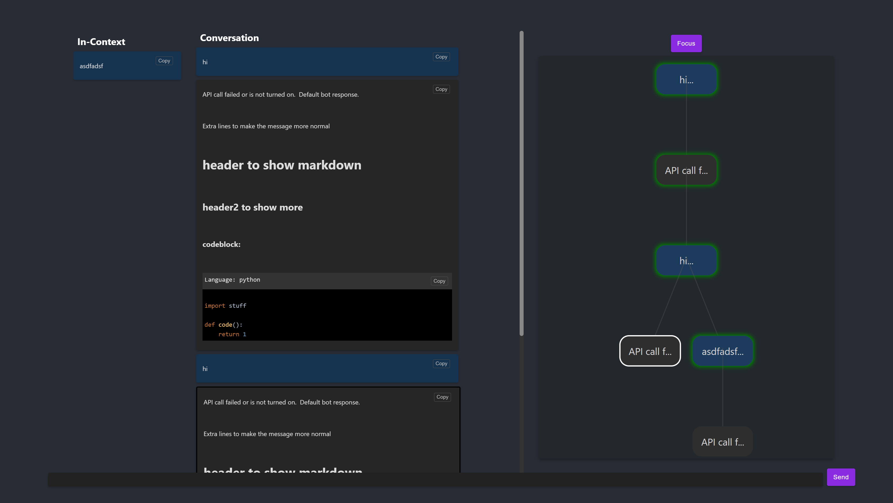
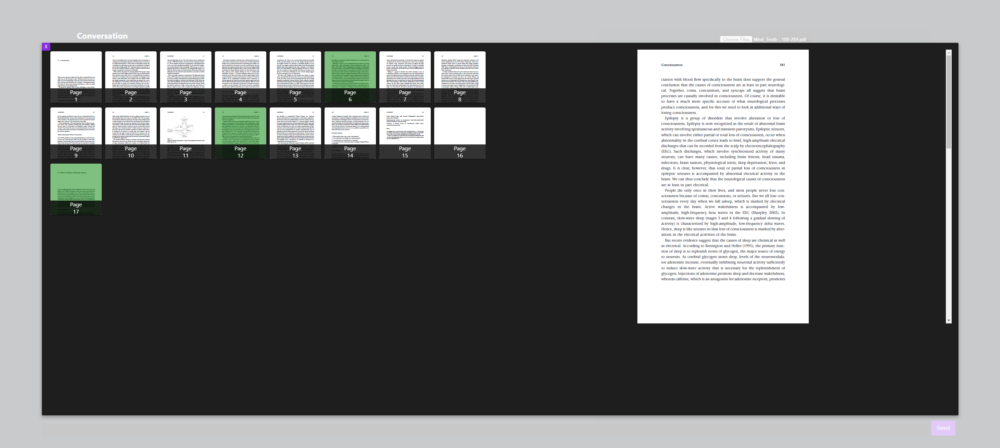
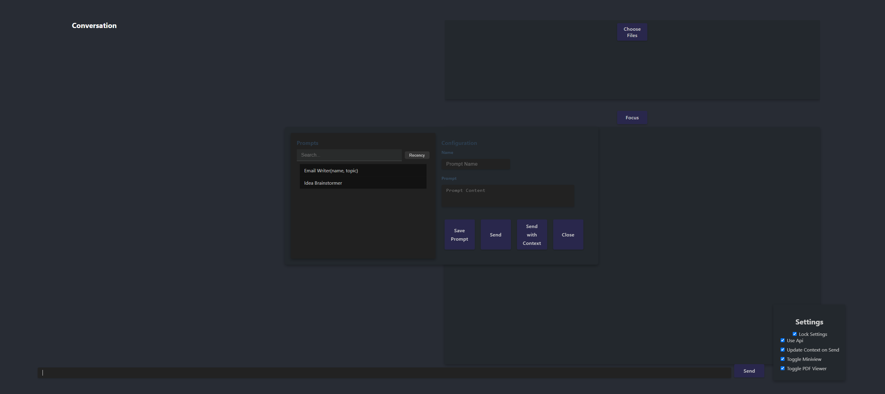
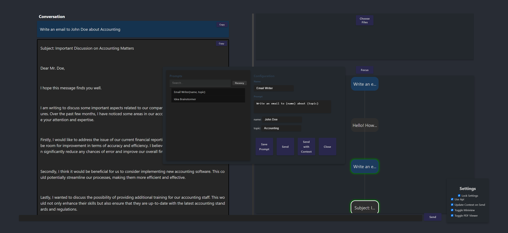

#### todo: 
-contextual sidebar: Has list of contexts for user to choose from, and displays links as well as key points in the current context of the chat(button to update this, toggle switch to auto update in settings).  Should also contain other useful buttons

-internet search: generate a few google search querys based on the context + user query, and then output the links along with a summary and answer the users request.

-gpt selects prompts: command to query gpt and it will select the prompt most closely related to your request and run it with its chosen parameters.

-pdf auto select: use gpt, pdf, and current conversation context to decide which pdf pages need to be selected.

-prompt generator button from name: input is name(para1, para2), generate prompt with parameters, and change name input area to just name and save prompt
# Chatbot UI


## How to Run

1. **Clone the Repository:**
    ```bash
    git clone https://github.com/austindaniel100/UIproj.git
    cd UIproj
    ```

2. **Install Dependencies:**
    ```bash
    npm install
    ```

3. **Start the Application:**
    ```bash
    npm start
    ```

The application will start running on `http://localhost:3000`, or another available port if `3000` is already in use.


## Interacting with the Bot

To interact with the bot and get responses:
- Ensure you have the API key set in the `.env` file.
- Set `useApi` to `true` in settings.
- The context for messages is determined by traversing up the tree of messages.
- Messages that are part of the context are highlighted in green.
- PDF pages that are part of the context are highlighted in green.

## Navigation Instructions

Navigate through the tree of messages using the arrow keys:

- **Up Arrow**: Move up the tree.
- **Down Arrow**: Move down the tree (prioritize leftmost branch).
- **Left Arrow**: Move to the direct left sibling.
- **Right Arrow**: Move to the direct right sibling.

For advanced navigation:

- **Ctrl + Up Arrow**: Navigate to the next parent with branching child.
- **Ctrl + Down Arrow**: Navigate down to a leaf.

### Mini-view Focus

To focus on the mini-view:
- Press `Ctrl + Q`.
- Middle-click.
- Click the "Focus" button.

### Branching

To branch the tree of messages, select a current message that isn't already a leaf and send a new message.

### TextAreaShortcuts

- **Enter**: To send a message and get a response.
- **Shift + Enter**: To add a newline in your message.
- **Ctrl + Enter**: To add a message to the tree without a bot response.


## PDF Interaction Features

The application now includes a sophisticated PDF interaction feature, enabling users to upload, view, and select specific pages from multiple PDF documents. This functionality is seamlessly integrated, enhancing the user interaction experience with the chatbot.

### Uploading and Viewing PDFs

1. **Upload PDFs:**
   - Users can upload one or more PDF documents by clicking the "Choose File" button.
   - Uploaded PDFs are displayed as thumbnails for easy access and identification.

2. **Viewing PDF Content:**
   - Double-click on any PDF thumbnail to open a modal with a detailed view of the document.
   - This detailed view allows users to browse through all the pages of the selected PDF.

### Selecting Pages for Context

- **Select Specific Pages:**
  - In the detailed view, users can click on individual pages or drag a selection to select.
    - **Ctrl + click** to deselect.
  - The selected pages are used to extract text, which becomes part of the chatbot’s context for dynamic conversations.
  - This feature enhances interaction, as the chatbot can reference content from the selected PDF pages for context-aware responses.

### Integration with Chatbot

- **Contextual Responses:**
  - Extracted text from selected PDF pages is utilized by the chatbot to provide more relevant and context-specific responses.
  - This integration leads to a more intuitive and enriched user experience, blending document content with intelligent chatbot interactions.

### Managing PDFs

- **Multi-PDF Support:**
  - The application supports uploading and managing multiple PDFs concurrently.
  - Each PDF is treated independently, allowing for individual page selection and document management.

- **Dynamic Interaction:**
  - Users can interact dynamically with the chatbot, leveraging the content of selected PDF pages.
  - This makes the chatbot an effective tool for handling specific inquiries or discussions based on the document content.

### Large View in PDF Interaction

- **Large View for PDFs:** Users can open a detailed Large View of any PDF page by double-clicking on its thumbnail.
- **Dynamic Sizing:** This view dynamically adjusts to the page's size, maintaining the correct aspect ratio and centering content horizontally.
- **Scrollable Interface:** Long pages are scrollable within the Large View, allowing complete page content access.
- **Enhanced Readability:** Offers a clearer and more detailed examination of PDF pages.
- **Easy Navigation:** Simplifies navigating through different pages within the Large View.


# PDF Page Selector



## New Features in Chatbot UI

### Predictive Command View
- Suggests commands based on user input.
- Navigate through suggestions using the Tab key, and select with Alt + Enter or a click.

### Dynamic Settings Popup
- Accessible via a `!settings` command.
- "Lock Settings" toggle pins the settings panel next to the chat input.
- Clicking outside the popup closes it unless "Lock Settings" is active.

### Responsive Chat Component Layout
- The chat component expands to full width when MiniView and PDF Viewer are off.
- Maintains a consistent layout when toggling these views.

### Toggleable MiniView and PDF Viewer
- New settings added for toggling MiniView and PDF Viewer.
- Components render based on their respective settings.


## Chatbot UI Hotkeys and Commands

### Navigation Hotkeys
- **Arrow Up**: Navigate to the parent message in the tree.
- **Arrow Down**: Navigate to the first child message in the tree.
- **Arrow Left**: Navigate to the left sibling message.
- **Arrow Right**: Navigate to the right sibling message.
- **Ctrl + Arrow Up**: Navigate to the next parent message with branching children.
- **Ctrl + Arrow Down**: Navigate down to a leaf message (no children).

### Message Interaction
- **Enter**: Send the message in the input field and receive a bot response.
- **Shift + Enter**: Add a newline in the message input field (multi-line input).
- **Ctrl + Enter**: Send a message without triggering a bot response.

### General Commands
- `!help`: Show help information. Use this command to get a brief description of all available commands.
- `!settings`: Show settings. This command displays the current settings of the application.
- `!prompt`: Open prompt popup. Use this to activate a prompt popup for user input.
- `!solo`: Toggles off other components. This command is used to focus on a single component by turning off others.
- `!toggle`: Toggle a setting. With this command, you can switch a specific setting on or off.
- `!clear`: Clear the current context. This command clears any ongoing operations or contexts.
- `!save`: Save the current context. Use this to save the current state or context of your session.
- `!load`: Load a saved context. This command allows you to load a previously saved context.

### PDF Commands
The `!pdf` command is a special command used for managing PDF documents within the application. It has several sub-commands:

- `view(name)`: Opens the viewer for the specified PDF. If no name is provided, it opens the first PDF in the list.
- `select(pages)`: Selects the specified pages of the currently active PDF.
- `deselect`: Deselects page numbers for a specified PDF. If no PDF is specified, it deselects pages for all PDFs.
- `clear`: Clears all PDFs from the viewer.
- `remove(name)`: Removes a specified PDF from the viewer. If no name is provided, no action is taken.

#### Usage
- To use a PDF command, type `!pdf` followed by the specific command and arguments. For example:
  - `!pdf view myDocument.pdf`: This would attempt to open a PDF named "myDocument.pdf" in the viewer.
  - `!pdf select 1-5`: This would select pages 1 to 5 of the currently active PDF.
  - `!pdf deselect`: This would deselect all selected pages in all PDFs.


### Additional Features
- **MiniView Focus**: Click the "Focus" button to center and zoom the MiniView on the tree of messages.
- **Predictive Commands**: As the user types, suggested commands appear based on input. Users can select a command with Tab, Alt + Enter, or mouse click.
- **Settings Popup**: Access settings to toggle features like 'Use Api', 'Update Context on Send', 'Toggle MiniView', and 'Toggle PDF Viewer'.

### PDF Interaction
- **Uploading PDFs**: Users can upload PDF documents to interact with the chatbot contextually.
- **Viewing PDFs**: Uploaded PDFs can be viewed and selected for extracting text to influence chatbot responses.
- **PDF Page Selection**: 
  - Click and drag to select multiple pages.
  - Ctrl + click and drag to select or deselect individual pages.


## Prompt Popup Component

The Prompt Popup component is a versatile addition to the chatbot UI, designed to enhance user interaction through customizable prompts. This feature allows users to efficiently manage and utilize various prompts tailored to their specific needs.

### Accessing the Prompt Popup

- **Trigger Command:**
  - To open the Prompt Popup, type `!prompt` in the chat interface. This command activates the component, bringing up the user interface for prompt management.

### Features and Functionalities

- **Custom Prompt Creation and Editing:**
  - Users can create new prompts or edit existing ones. Each prompt consists of a name and content.
  - The content can include placeholders for parameters, denoted by curly braces `{}`, which dynamically generate input fields.

- **Dynamic Parameter Inputs:**
  - When parameters are included in a prompt, the interface automatically generates corresponding text boxes for each parameter.
  - Users can input specific values in these boxes, customizing the prompt before sending it to the chatbot.

- **Intuitive Navigation:**
  - The component supports keyboard navigation. Users can cycle through input fields, buttons, and other interactive elements using the Tab key.

- **Real-Time Interaction:**
  - As parameters are filled in, the prompt content updates in real-time, reflecting the changes immediately.
  - This feature allows users to see how their input affects the prompt before sending it.

- **Prompt Management:**
  - A list of saved prompts is displayed, which users can filter by name or content.
  - Prompts can be sorted alphabetically or by recency, aiding in quick retrieval.

- **Sending Customized Prompts:**
  - After customizing a prompt, users can send it directly to the chatbot.
  - The option to include or exclude additional context with the prompt is available, catering to different interaction needs.

- **Saving and Organizing Prompts:**
  - New prompts can be saved for future use.
  - Users have the option to overwrite existing prompts if they need to update them.

### User Experience Enhancements

- **Search Functionality:**
  - Users can quickly find specific prompts using the search function, which filters prompts based on user input.
  
- **User-Friendly Interface:**
  - The design is focused on ease of use, with clear labels and responsive inputs.
  - Hover effects on list items improve visual feedback and navigation.

This component significantly streamlines the process of customizing interactions with the chatbot, especially for users who frequently engage with complex or specific queries. It not only enhances the flexibility of the chatbot but also adds a layer of personalization to the user experience.


# Prompt popup view


# Prompt popup view example

