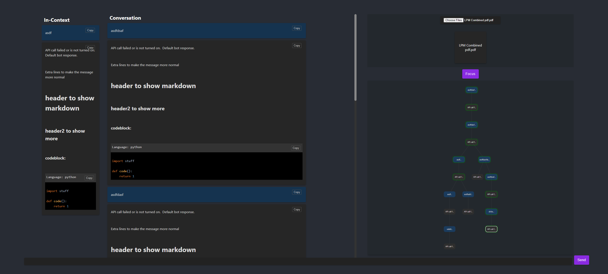

The way i made the spacial chat works fine, but is kinda trash(never really coded much in javascript before, so that was more me learning), so i'll probably just re-do that whole part of it, but the miniview, and backend all work great.  gonna add pdf uploading and message selecting context determination, custom prompt management, and probably a couple other things idk.  Code is formatted slightly better and commented now.

# Chatbot UI


## How to Run

1. **Clone the Repository:**
    ```bash
    git clone https://github.com/austindaniel100/UIproj.git
    cd UIproj
    ```

2. **Install Dependencies:**
    ```bash
    npm install
    ```

3. **Start the Application:**
    ```bash
    npm start
    ```

The application will start running on `http://localhost:3000`, or another available port if `3000` is already in use.


## Interacting with the Bot

To interact with the bot and get responses:
- Ensure you have the API key set in the `.env` file.
- Set `useApi` to `true` in `botReplyHandler.js`.
- The context for messages is determined by traversing up the tree of messages.
- Messages that are part of the context are highlighted in green.

## Navigation Instructions

Navigate through the tree of messages using the arrow keys:

- **Up Arrow**: Move up the tree.
- **Down Arrow**: Move down the tree (prioritize leftmost branch).
- **Left Arrow**: Move to the direct left sibling.
- **Right Arrow**: Move to the direct right sibling.

For advanced navigation:

- **Ctrl + Up Arrow**: Navigate to the next parent with branching child.
- **Ctrl + Down Arrow**: Navigate down to a leaf.

### Mini-view Focus

To focus on the mini-view:
- Press `Ctrl + Q`.
- Middle-click.
- Click the "Focus" button.

### Branching

To branch the tree of messages, select a current message that isn't already a leaf and send a new message.

### TextAreaShortcuts

- **Enter**: To send a message and get a response.
- **Shift + Enter**: To add a newline in your message.
- **Ctrl + Enter**: To add a message to the tree without a bot response.


## PDF Interaction Features

The application includes a sophisticated PDF interaction feature, allowing users to upload, view, and select specific pages from multiple PDF documents. This functionality is integrated into the chatbot's context, enhancing the interaction experience.

### Uploading and Viewing PDFs

1. **Upload PDFs:**
   - Click the "Choose File" button to upload one or more PDF documents.
   - Uploaded PDFs will be displayed as thumbnails within the application.

2. **Viewing PDF Content:**
   - Double-click on any PDF thumbnail to open a detailed view.
   - In this detailed view, you can browse through all the pages of the selected PDF.

### Selecting Pages for Context

- **Select Specific Pages:**
  - While viewing a PDF, click on individual pages to select or deselect them.
  - The selected pages are used to extract text, which becomes part of the chatbot’s context.
  - This feature allows for a more dynamic and contextual interaction with the bot, as it can reference content from the selected PDF pages.

### Integration with Chatbot

- **Contextual Responses:**
  - The text extracted from selected pages of PDFs is used by the chatbot to provide more accurate and context-aware responses.
  - This integration allows for a seamless blend of document content and chatbot intelligence, enhancing the overall user experience.

### Managing PDFs

- **Multi-PDF Support:**
  - You can upload and manage multiple PDFs simultaneously.
  - Each PDF acts independently, allowing for separate page selections and views.

- **Dynamic Interaction:**
  - Interact dynamically with the chatbot using the content of your selected PDF pages.
  - This feature makes the chatbot an effective tool for handling inquiries or discussions based on document content.
